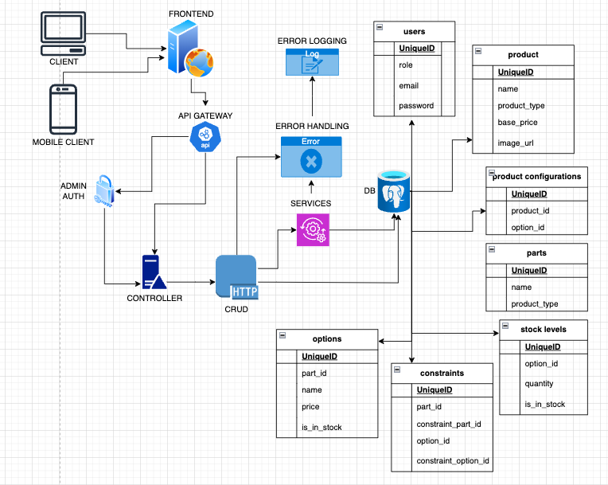

# Overview

The e-commerce application is a two-part system consisting of a [backend Rails API](https://github.com/ilcande/ecommerce-shop-backend) and a frontend React application. The backend Rails application serves as an API-only server that provides a robust and scalable interface for CRUD operations, business logic, and data management. The frontend React application, styled with Tailwind CSS, acts as the user interface through which end-users interact with the application.

## Architecture Backend (Rails API)

Technology Stack:

  1. **React**: Frontend JavaScript library for building user interfaces.
  2. **Tailwind CSS**: Utility-first CSS framework for styling the frontend.

### Components

  Pages:

  Represent various views and routes in the application.
  Examples: `AdminDashboard`, `HomePage`.

  Hooks:

  Encapsulate reusable logic and data fetching.
  Examples: `useCreateStockLevel` for managing stock level form interactions.

  Components:

  Reusable UI elements that represent parts of the interface.
  Examples: `CreateStockLevel` form component, `Products` list component.

  State Management:

  Managed locally within components or hooks.information for debugging and monitoring.
  State management libraries like Redux are not used in this implementation, relying on React's built-in state management.

  API Integration:

  `Axios` is used for making HTTP requests to the Rails API.
  Components and hooks handle data fetching, form submissions, and error handling.

  Routing:
    React Router is used for client-side routing.
    Routes are defined in the `App` component, which renders the appropriate page based on the URL.

## Data Flow

The frontend React application interacts with the backend Rails API through HTTP requests. The API processes these requests, performs CRUD operations on the PostgreSQL database, and returns the appropriate responses. The frontend application then updates the UI based on the responses received.
  **User Interaction**:
  Users interact with the frontend React application via UI components.

  **API Requests**:
  React components make HTTP requests to the Rails API using Axios.

  **Controller Handling**:
    Rails controllers receive requests, perform necessary operations, and send responses.

  **Service Layer (if applicable)**:
    Complex business logic is handled by service objects.

  **Database Operations**:
    Models interact with PostgreSQL to perform CRUD operations.

  **Response Handling**:
    The Rails API returns data or status codes, which are then processed by React components.
  
  **Error Logging and Authentication**:
    Errors are logged and managed centrally.
    Authentication ensures secure access to administrative functions.

## System Design

The system is designed to be modular, scalable, and maintainable. The separation of concerns between the frontend and backend allows for independent development and deployment of each part. The fontend communicates with the backend through a RESTful API, which provides a clear interface for data management and business logic.

## Scalability and Performance

The system is designed to be scalable and performant by following best practices and utilizing appropriate technologies.

  **Scalability**:
    Both the backend and frontend are designed to handle growing user bases and data sizes.

  **Database Optimization**:
    Proper indexing, query optimization, and database tuning to improve performance.

  **Maintainability**:
    The separation of concerns (controllers, services, models) ensures that the codebase is maintainable and extensible.
